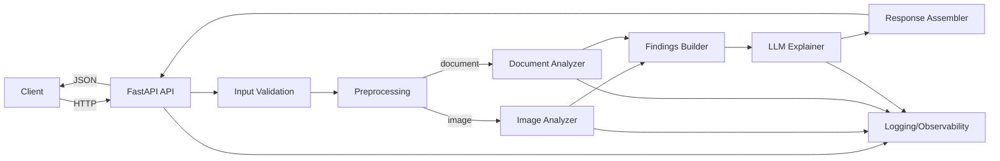
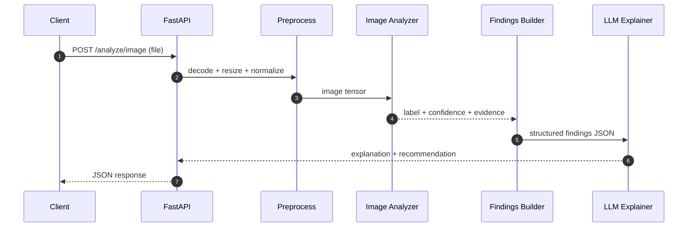
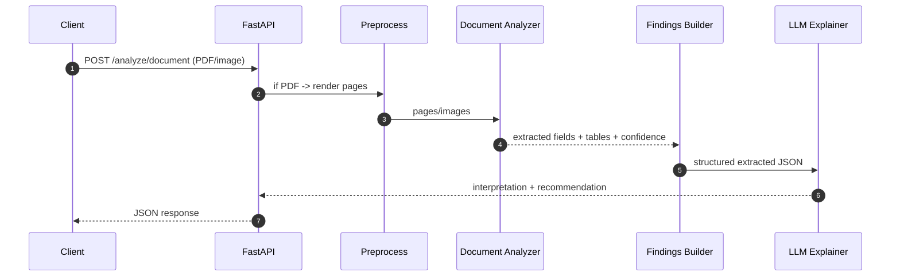

# Architecture

## 1. Architecture Summary

This project is a domain-agnostic **multimodal AI service** that:

- Accepts **images** (JPEG/PNG) and **documents** (PDFs / scanned images)
- Runs a **perception step** (vision or document understanding)
- Produces **structured findings** (labels, extracted fields, confidence, evidence)
- Uses an **LLM reasoning step** to generate **grounded explanations and recommendations**
- Returns a consistent JSON response via a production-style FastAPI interface

The design mirrors real-world VLM usage patterns: **separate perception from reasoning**, keep components swappable, and enforce grounded outputs.

---

## 2. High-Level Component Diagram



---

## 3. Key Architectural Principles

1. **Perception ≠ Reasoning**
   - Perception produces structured signals from visual inputs.
   - Reasoning turns those signals into natural-language explanations.

2. **Swappable model adapters**
   - Image analyzer, document analyzer, and LLM are abstracted behind adapters.
   - You can swap a model/service without rewriting the pipeline.

3. **Grounded outputs by construction**
   - The LLM receives only structured findings and is instructed to avoid inventing facts.

4. **Consistent contract**
   - Both `/analyze/image` and `/analyze/document` return the same top-level schema.

---

## 4. Data Flow

### 4.1 Image Analysis Flow



**Perception Output (example):**
- `finding` (label)
- `confidence`
- `details` (top-k labels, embedding metadata, etc.)

**Reasoning Output (example):**
- `explanation`
- `recommendation`
- optional `warnings` (e.g., low confidence)

---

### 4.2 Document Analysis Flow



**Perception Output (example):**
- extracted fields and tables
- confidence scores
- page/region metadata (optional)

---

## 5. Modules and Responsibilities

### 5.1 API Layer (FastAPI)
**Responsibilities**
- Request parsing + validation
- Enforce input limits (type, size, max pages)
- Orchestrate pipeline via service layer
- Return consistent response schema
- Error handling (400/422/500)

**Endpoints**
- `POST /analyze/image`
- `POST /analyze/document`
- `GET /healthz` (recommended)

---

### 5.2 Preprocessing Layer
**Image preprocessing**
- Decode image bytes
- Resize to model input
- Normalize
- (Optional) quality checks (blur/darkness heuristics)

**Document preprocessing**
- If PDF: render pages to images (configurable DPI)
- Standardize page size/resolution
- (Optional) deskew/rotate

Outputs a normalized representation for the analyzer.

---

### 5.3 Perception Layer

#### Image Analyzer
- Wraps a pre-trained vision encoder/model
- Produces:
  - classification label(s)
  - confidence
  - optional evidence (top-k labels, embedding info)

#### Document Analyzer
- Wraps a document understanding system (managed service or local model)
- Produces:
  - extracted fields and tables
  - confidence scores
  - optional layout/page metadata

---

### 5.4 Findings Builder
Normalizes perception outputs into a consistent internal format:

- maps model/service outputs into a stable schema
- attaches confidence, evidence, and warnings
- ensures predictable structure for the LLM layer

---

### 5.5 LLM Explainer
- Takes structured findings and generates:
  - `explanation`
  - `recommendation`
- Enforces grounding constraints:
  - refer only to provided fields/labels
  - if confidence is low or required fields missing, produce a warning and suggest next action

---

### 5.6 Observability
Minimal but production-minded observability:

- Request ID for correlation
- Step timings: preprocessing, perception, LLM
- Model/service version metadata
- Structured logs for failures

---

## 6. Contracts

### 6.1 Response Shape (top-level)

```json
{
  "finding": "string",
  "confidence": 0.0,
  "details": {"key": "value"},
  "explanation": "string",
  "recommendation": "string",
  "warnings": ["string"]
}
```

Notes:
- `details` differs by analyzer, but remains JSON-serializable.
- `warnings` is optional.

---

## 7. Failure Modes and Handling

- **Unsupported file type** → `400 Bad Request`
- **File too large / too many pages** → `413 Payload Too Large`
- **Preprocessing failure (corrupt image/PDF)** → `422 Unprocessable Entity`
- **Analyzer failure (model/service timeout)** → `502 Bad Gateway` or `504 Gateway Timeout`
- **LLM failure** → `502 Bad Gateway`

All failures should:
- return a stable error response
- log request_id + stage + error details

---

## 8. Extensibility

Designed extension points:

- Add new analyzers (e.g., `ScreenshotAnalyzer`, `ReceiptAnalyzer`)
- Swap vision encoders (CNN ↔ ViT)
- Swap document engine (managed service ↔ open-source)
- Swap LLM provider/model
- Add async processing (job queue) for large PDFs

---

## 9. Deployment View (Local First)

- Local development: FastAPI + local analyzers (where possible)
- Optional cloud adapters:
  - managed document engine
  - hosted LLM

A future production deployment would containerize the API service and use environment-based configuration for model/service adapters.

---

## 10. Why This Architecture is “VLM-Aligned”

The system follows a practical production pattern for multimodal AI:

- **Perception** extracts visual signals (labels/fields/confidence)
- **Reasoning** converts signals into a user-facing narrative

This mirrors how many VLM-backed products are engineered at scale: the multimodal model(s) are integrated as components, while the service focuses on robustness, grounding, and reliable delivery.

