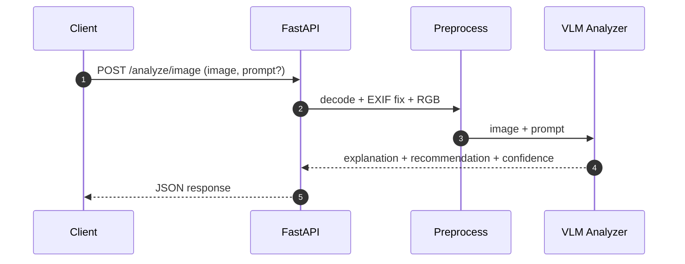
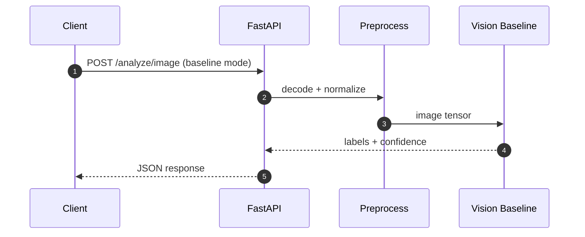
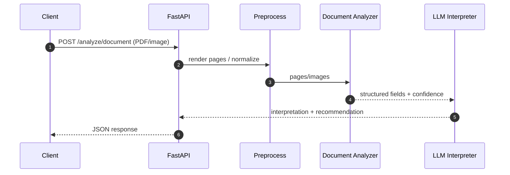

# Architecture

## 1. Architecture Summary (VLM‑First)

This project implements a **VLM‑first multimodal AI service** for image and document analysis.

**Primary principle:** image understanding is performed by a **Vision‑Language Model (VLM)** that reasons jointly over visual input and text prompts. Vision‑only models are supported **only as optional baselines**, not as the default path.

The system:
- Accepts **images** (JPEG/PNG) and **documents** (PDFs / scanned images)
- Uses **true multimodal reasoning** for image analysis (image + prompt → language output)
- Uses **document understanding** for extraction, followed by grounded language interpretation
- Returns a consistent JSON response via a production‑style FastAPI interface

---

## 2. High‑Level Architecture (Logical View)

```mermaid
flowchart LR
    C[Client]
    C -->|HTTP| API[FastAPI API]

    API --> V1[Input Validation]
    V1 --> P[Preprocessing]

    %% Image paths
    P -->|image + prompt| VLM[VLM Image Analyzer]
    P -->|image| VIS[Vision‑Only Baseline (Optional)]

    %% Document path
    P -->|document| DOC[Document Analyzer]

    %% Outputs
    VLM --> R[Response Assembler]
    VIS --> R
    DOC --> LLM2[LLM Interpreter]
    LLM2 --> R

    R --> API
    API -->|JSON| C

    API --> LOG[Logging & Observability]
    VLM --> LOG
    DOC --> LOG
    LLM2 --> LOG
```

---

## 3. Core Architectural Principles

### 3.1 VLM‑First Image Reasoning
- Image analysis is performed by a **Vision‑Language Model** that directly conditions language generation on visual input.
- The LLM *sees the image*, not a summary of labels.

### 3.2 Separation of Perception Modes
- **Primary:** VLM image analyzer (image + prompt)
- **Secondary:** vision‑only baseline (classifier / embeddings) for debugging and comparison

### 3.3 Grounded Outputs by Design
- Language output must be grounded in visual or extracted evidence.
- Uncertainty and low‑confidence cases must be surfaced explicitly.

### 3.4 Swappable Adapters
- VLMs, vision backbones, and document engines are accessed through adapters.
- Models can be swapped without changing API contracts.

---

## 4. Data Flows

### 4.1 Image Analysis — VLM Path (Primary)



**Key characteristics**
- Language reasoning is directly conditioned on visual content
- No intermediate label requirement
- Suitable for open‑ended reasoning tasks

---

### 4.2 Image Analysis — Vision‑Only Baseline (Optional)



**Purpose**
- Debugging perception
- Evaluation and comparison
- Not the default pipeline

---

### 4.3 Document Analysis Flow



Documents are treated as **extraction + interpretation** tasks rather than end‑to‑end VLM reasoning.

---

## 5. Module Responsibilities

### 5.1 API Layer (FastAPI)
- Request parsing and validation
- Pipeline orchestration
- Stable response schema
- Error handling and request IDs

---

### 5.2 Preprocessing Layer
- Decode image bytes
- Fix EXIF orientation
- Convert to RGB
- Enforce size/type limits

Preprocessing does **not** assume model‑specific resizing unless required by an adapter.

---

### 5.3 VLM Image Analyzer (Primary)
- Accepts image + optional prompt
- Performs multimodal reasoning
- Produces explanation, recommendation, and uncertainty
- Exposes model metadata

---

### 5.4 Vision‑Only Baseline (Optional)
- Uses pre‑trained vision models
- Produces labels/embeddings
- Used for evaluation and debugging only

---

### 5.5 Document Analyzer
- OCR + layout + key‑value extraction
- Returns structured fields and confidence

---

### 5.6 Language Interpretation Layer (Documents)
- Interprets extracted fields
- Generates grounded explanations
- Avoids speculative or domain‑specific claims

---

## 6. Response Contract (Conceptual)

```json
{
  "finding": "string",
  "confidence": 0.0,
  "details": {"key": "value"},
  "explanation": "string",
  "recommendation": "string",
  "warnings": ["string"]
}
```

The same contract is used for both VLM and non‑VLM paths.

---

## 7. Failure Modes

- Unsupported input → `400`
- Oversized payload → `413`
- Corrupt image/PDF → `422`
- Model timeout/failure → `502` / `504`

Failures are logged with request‑level correlation IDs.

---

## 8. Why This Architecture Is Truly VLM‑Aligned

- The language model reasons **directly over visual input**
- Vision‑only models are explicitly secondary
- The design mirrors real production multimodal systems that balance control, cost, and explainability

---

**End of Architecture**

